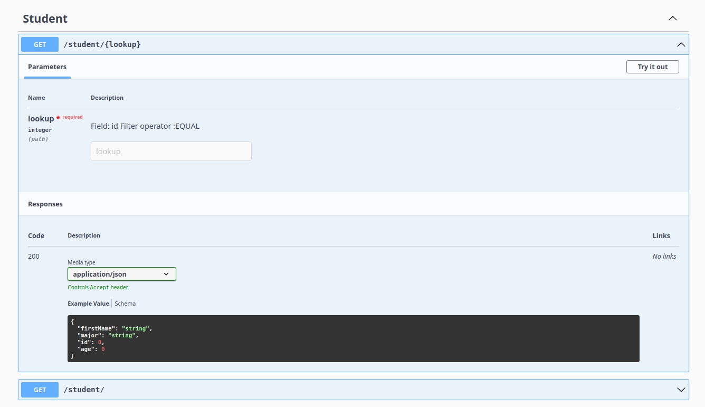

# Spring REST Framework

<p align="center">

</p>
Spring REST Framework is a powerful and flexible toolkit for building REST APIs in Spring, inspired by Django REST
framework.

## Features

- **Developer-Friendly**: Effortlessly generates web APIs while eliminating the need for
  boilerplate code, simplifying the task of exposing standard endpoints (GET, POST, PUT, PATCH) for each ORM entity.
- **Serialization**: The comprehensive and flexible serializer, integrated with Spring Data JPA, assists developers in
  customizing the input and output in web APIs.
- **Filters**: Offers flexibility and powerful filtering in APIs to query data from database.

## Requirements

- Java 17+
- Spring Boot 3.0.0+
- Spring Data JPA
- Spring Web MVC
- SpringDoc OpenAPI WebMVC UI 2.1.0+

## Installation

To install the Spring REST Framework, include the following dependencies in your project:

```xml

<dependencies>
    <dependency>
        <groupId>org.springframework.boot</groupId>
        <artifactId>spring-boot-starter-data-jpa</artifactId>
    </dependency>
    <dependency>
        <groupId>org.springframework.boot</groupId>
        <artifactId>spring-boot-starter-web</artifactId>
    </dependency>
    <dependency>
        <groupId>org.springdoc</groupId>
        <artifactId>springdoc-openapi-starter-webmvc-ui</artifactId>
        <version>2.1.0</version>
    </dependency>
    <dependency>
        <groupId>io.github.nikanique</groupId>
        <artifactId>spring-rest-framework</artifactId>
        <version>1.0.1</version>
    </dependency>
</dependencies>
```

## Getting Started

To start using the library, follow these steps:

1. Add the necessary dependencies to your project:
   Add the required dependencies into your project following the
   installation section.


2. 2.Declare your models and repositories:

   For example, declare a Student model.

   ```java
 
    import jakarta.persistence.Entity;
    import jakarta.persistence.GenerationType;
    import jakarta.persistence.Id;
    import lombok.Data;
     
    @Entity
    @Data
    public class Student {
    @Id
    @GeneratedValue(strategy = GenerationType.IDENTITY)
    private Long id;
    private String fullName;
    private Integer age;
    private String major;
     
    }
 
   ```
   Create Repository for you model.
    ```java
    import com.example.demo.model.Student;
    import org.springframework.data.jpa.repository.JpaRepository;
    import org.springframework.data.jpa.repository.JpaSpecificationExecutor;
    import org.springframework.stereotype.Repository;
     
    @Repository
    public interface StudentRepository extends JpaRepository<Student, Long>, JpaSpecificationExecutor<Student> {
    }
    ```

3. Configure your API endpoints and serializers DTO:
   declare a DTO representing your model's field in web API.
   ```java
   import io.github.nikanique.springrestframework.annotation.Expose;
   import io.github.nikanique.springrestframework.annotation.ReadOnly;
   import io.github.nikanique.springrestframework.dto.Dto;
   import lombok.Data;
  
   @Data
   public class StudentDto extends Dto{
  
    @Expose(source = "name")
    private String firstName;
    private Integer age;
    private String major;
     
    @ReadOnly
    private Long id;
   }
   ```
   Create your Controller by extending **GenericQueryController** which will generate List and Retrieve endpoint for
   you.

   ```java
    import io.github.nikanique.springrestframework.web.controllers.GenericQueryController;@RequestMapping("/student")
    @RestController
    @Tag(name = "Student")
    public class StudentController extends GenericQueryController<Student, Long, StudentRepository> {
        public StudentController(StudentRepository repository) {
            super(repository);
        }
      
        @Override
        protected Class<?> getDTO() {
            return Student.class;
        }
    }  
   ```

   Add desired filters to the endpoint by using **FilterSet** class:

   ```java
    import io.github.nikanique.springrestframework.web.controllers.GenericQueryController;
            
    @RequestMapping("/student")
    @RestController
    @Tag(name = "Student")
    public class StudentController extends GenericQueryController<Student, Long, StudentRepository> {
        public StudentController(StudentRepository repository) {
            super(repository);
        }
      
        @Override
        protected Class<?> getDTO() {
            return Student.class;
        }
       @Override
       protected FilterSet configFilterSet() {
            return FilterSet.builder()
                   .addFilter("name", FilterOperation.CONTAINS, FieldType.STRING)
                    .build();
         }
  
    }  
    ```
   Specify allowed fields to order the result by using **configAllowedOrderByFields** method:

   ```java
    import io.github.nikanique.springrestframework.web.controllers.GenericQueryController;
            
    @RequestMapping("/student")
    @RestController
    @Tag(name = "Student")
    public class StudentController extends GenericQueryController<Student, Long, StudentRepository> {
        public StudentController(StudentRepository repository) {
            super(repository);
        }
      
        @Override
        protected Class<?> getDTO() {
            return Student.class;
        }
       @Override
       protected FilterSet configFilterSet() {
            return FilterSet.builder()
                   .addFilter("name", FilterOperation.CONTAINS, FieldType.STRING)
                    .build();
         }
       
       @Override
       public Set<String> configAllowedOrderByFields() {
        return Set.of("name", "id");

       }
    }  
    ```
4. Run your application, and enjoy your APIs:



## License

This project is licensed under the BSD 3-Clause License.

## Contact & Issues

For any questions or feedback, please contact the author at nikanique.org@gmail.com. If you
encounter any problems or bugs with the library, kindly create an issue to report them.