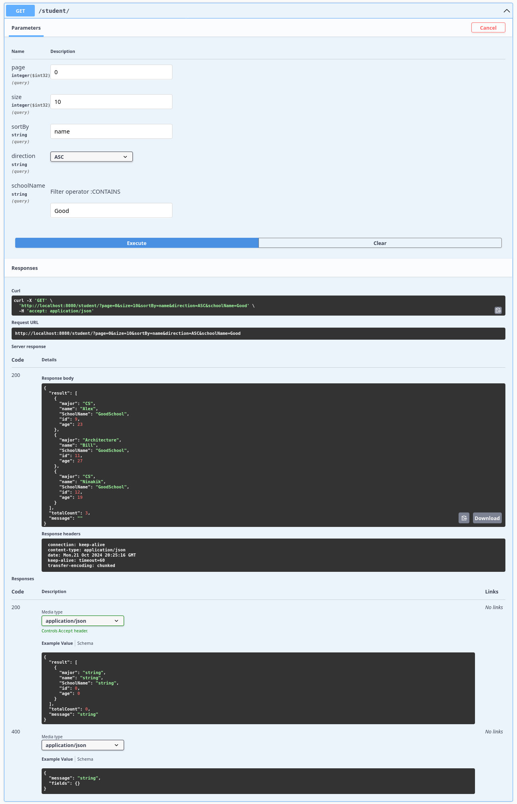

# Spring REST Framework

<p align="center">

</p>
Spring REST Framework is a powerful and flexible toolkit for building REST APIs in Spring, inspired by Django REST
framework.

## Features

- **Developer-Friendly**: Simplifies API development by automatically generating web endpoints (GET, POST, PUT, PATCH)
  for ORM entities, eliminating boilerplate code and streamlining common tasks.
- **Serialization**: Robust and flexible serializer, seamlessly integrated with Spring Data JPA, enabling
  easy customization of API input and output formats.
- **Filtering**: Provides powerful and versatile filtering capabilities for querying data directly from the database.
- **Validation**: Ensures reliable endpoint validation with a wide range of rules and supports custom validation for
  user input.
- **Security**: Built-in integration with Spring Security delivers secure access control, safeguarding APIs and
  resources for authorized users.

## Requirements

- Java 17+
- Spring Boot 3.0.0+

## Installation

To install the Spring REST Framework, include the following dependencies in your project:

```xml

<dependencies>
    <!-- Other dependencies -->
    <dependency>
        <groupId>io.github.nikanique</groupId>
        <artifactId>spring-rest-framework</artifactId>
        <version>{latest version}</version>
    </dependency>
</dependencies>
```

## Getting Started

To start using the library, follow these steps:

1. Add the necessary dependencies to your project:
   Add the required dependencies into your project following the installation section.

2. Declare your models and repositories:

   For example, declare a Student model.

   ```java
    import jakarta.persistence.Entity;
    import jakarta.persistence.GenerationType;
    import jakarta.persistence.Id;
    import lombok.Data;
     
    @Entity
    @Data
    public class Student {
       @Id
       @GeneratedValue(strategy = GenerationType.IDENTITY)
       private Long id;
       private String fullName;
       private Integer age;
       private String major;
      
       @ManyToOne(fetch = FetchType.EAGER)
       @JoinColumn(name = "school_id")
       private School school;
     
    }
 
   ```

   Create Repository for you model.
    ```java
    import com.example.demo.model.Student;
    import org.springframework.data.jpa.repository.JpaRepository;
    import org.springframework.data.jpa.repository.JpaSpecificationExecutor;
    import org.springframework.stereotype.Repository;
     
    @Repository
    public interface StudentRepository extends JpaRepository<Student, Long>, JpaSpecificationExecutor<Student> {
    }
    ```

3. Configure your API endpoints and serializers DTO:
   declare a DTO representing your model's field in web API.
   ```java
   import io.github.nikanique.springrestframework.annotation.Expose;
   import io.github.nikanique.springrestframework.annotation.ReadOnly;
   import io.github.nikanique.springrestframework.dto.Dto;
   import lombok.Data;
  
   @Data
   public class StudentDto extends Dto{
  
    @Expose(source = "fullName")
    private String name;
    private Integer age;
    private String major;
    
    @Expose(source = "school__name")
    private String SchoolName;    
   
    @ReadOnly
    private Long id;
   }
   ```
   Create your Controller by extending **GenericQueryController** which will generate List and Retrieve endpoint for
   you.

   ```java
    import io.github.nikanique.springrestframework.web.controllers.GenericQueryController;@RequestMapping("/student")
    @RestController
    @Tag(name = "Student")
    public class StudentController extends GenericQueryController<Student, Long, StudentRepository> {
        public StudentController(StudentRepository repository) {
            super(repository);
        }
      
        @Override
        protected Class<?> getDTO() {
            return StudentDto.class;
        }
    }  
   ```

   Add desired filters to the endpoint by using **FilterSet** class:

   ```java
    import io.github.nikanique.springrestframework.common.FieldType;import io.github.nikanique.springrestframework.filter.FilterOperation;import io.github.nikanique.springrestframework.web.controllers.GenericQueryController;
            
    @RequestMapping("/student")
    @RestController
    @Tag(name = "Student")
    public class StudentController extends GenericQueryController<Student, Long, StudentRepository> {
        public StudentController(StudentRepository repository) {
            super(repository);
        }
      
        @Override
        protected Class<?> getDTO() {
            return StudentDto.class;
        }
       @Override
       protected FilterSet configFilterSet() {
            // Filters student with age greater than given value and school name contains given string
            return FilterSet.builder()
                   .addFilter("age", FilterOperation.GREATER, FieldType.INTEGER)
                   .addFilter("schoolName","school__name", FilterOperation.CONTAINS, FieldType.STRING)
                   .build();
         }
  
    }  
    ```
   Specify allowed fields to order the result using **configAllowedOrderByFields** method:

   ```java
    import io.github.nikanique.springrestframework.web.controllers.GenericQueryController;
            
    @RequestMapping("/student")
    @RestController
    @Tag(name = "Student")
    public class StudentController extends GenericQueryController<Student, Long, StudentRepository> {
        public StudentController(StudentRepository repository) {
            super(repository);
        }
      
        @Override
        protected Class<?> getDTO() {
            return StudentDto.class;
        }
       @Override
       protected FilterSet configFilterSet() {
            return FilterSet.builder()
                    .addFilter("name", "fullName", FilterOperation.CONTAINS, FieldType.STRING)
                    .build();
         }
       
       @Override
       public Set<String> configAllowedOrderByFields() {
        return Set.of("name", "id");

       }
    }  
    ```
4. Run your application, and enjoy your APIs:



## Architecture

The framework is built on top of Spring Boot, Spring MVC, Spring Data JPA and Spring Security, providing an robust
suite of tools for developing REST APIs. The core components are as follows:
<p align="center">

</p>

## Documentation

For detailed documentation and examples, visit the
project's [Documentation](https://spring-rest-framework-tutorial.readthedocs.io/en/latest/).

## License

This project is licensed under the BSD 3-Clause License.

## Contact & Issues

For any questions or feedback, please contact the author at nikanique.org@gmail.com. If you
encounter any problems or bugs with the library, kindly create an issue to report them.
